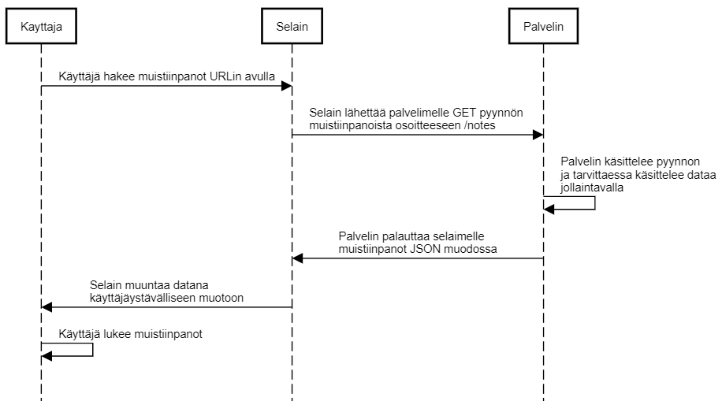

0.3 Muistiinpanojen sivu

Kuvana:



Tekstinä:

```Kayttaja->Selain: Käyttäjä hakee muistiinpanot URLin avulla

Selain->Palvelin: Selain lähettää palvelimelle GET pyynnön \nmuistiinpanoista osoitteeseen /notes

Palvelin->Palvelin: Palvelin käsittelee pyynnon\nja tarvittaessa käsittelee dataa\njollaintavalla

Palvelin->Selain: Palvelin palauttaa selaimelle \nmuistiinpanot JSON muodossa

Selain->Kayttaja: Selain muuntaa datana \nkäyttäjäystävälliseen muotoon

Kayttaja->Kayttaja: Käyttäjä lukee muistiinpanot```