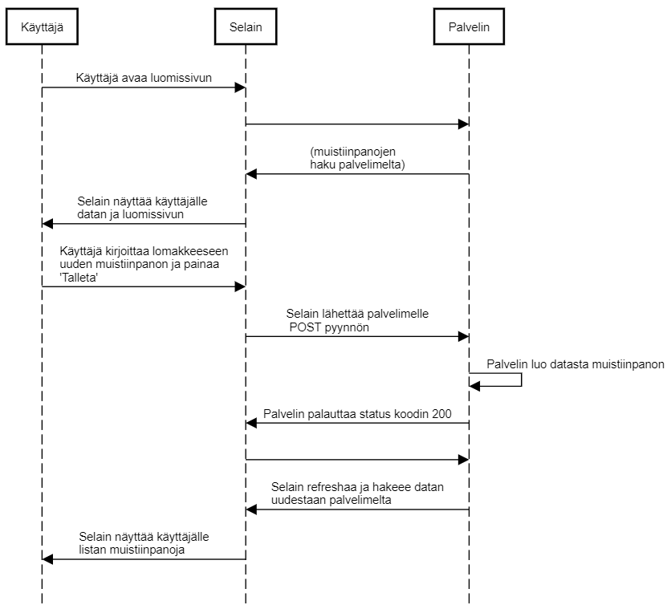

0.4 Uusi muistiinpano

Kuvana:



Tekstinä:

```
Käyttäjä->Selain: Käyttäjä avaa luomissivun

Selain->Palvelin:
Palvelin->Selain: (muistiinpanojen\nhaku palvelimelta)

Selain->Käyttäjä: Selain näyttää käyttäjälle \ndatan ja luomissivun

Käyttäjä->Selain: Käyttäjä kirjoittaa lomakkeeseen\nuuden muistiinpanon ja painaa\n'Talleta'

Selain->Palvelin: Selain lähettää palvelimelle\n POST pyynnön

Palvelin->Palvelin: Palvelin luo datasta muistiinpanon

Palvelin->Selain: Palvelin palauttaa status koodin 200

Selain->Palvelin:
Palvelin->Selain: Selain refreshaa ja hakeee datan\nuudestaan palvelimelta

Selain->Käyttäjä: Selain näyttää käyttäjälle\nlistan muistiinpanoja
```

Kopio koodi [SequenceDiagramiin](https://sequencediagram.org/)