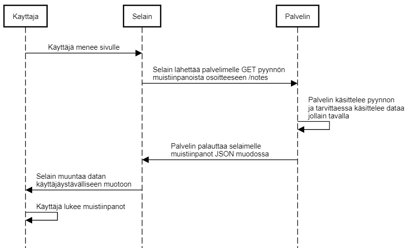

0.5 Single page app

Kuvana:



Tekstinä:

```
Kayttaja->Selain: Käyttäjä menee sivulle

Selain->Palvelin: Selain lähettää palvelimelle GET pyynnön \nmuistiinpanoista osoitteeseen /notes

Palvelin->Palvelin: Palvelin käsittelee pyynnon\nja tarvittaessa käsittelee dataa\njollain tavalla

Palvelin->Selain: Palvelin palauttaa selaimelle \nmuistiinpanot JSON muodossa

Selain->Kayttaja: Selain muuntaa datan \nkäyttäjäystävälliseen muotoon

Kayttaja->Kayttaja: Käyttäjä lukee muistiinpanot
```