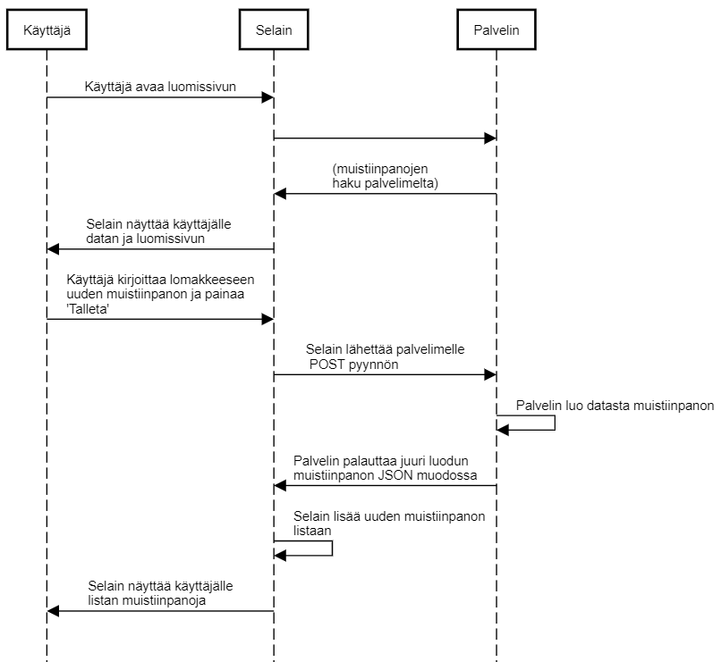

0.6 Uusi muistiinpano SPA

Kuvana:



Tekstinä:

```
Käyttäjä->Selain: Käyttäjä avaa luomissivun

Selain->Palvelin:

Palvelin->Selain: (muistiinpanojen\nhaku palvelimelta)

Selain->Käyttäjä: Selain näyttää käyttäjälle \ndatan ja luomissivun

Käyttäjä->Selain: Käyttäjä kirjoittaa lomakkeeseen\nuuden muistiinpanon ja painaa\n'Talleta'

Selain->Palvelin: Selain lähettää palvelimelle\n POST pyynnön

Palvelin->Palvelin: Palvelin luo datasta muistiinpanon

Palvelin->Selain: Palvelin palauttaa juuri luodun\nmuistiinpanon JSON muodossa

Selain->Selain: Selain lisää uuden muistiinpanon\nlistaan

Selain->Käyttäjä: Selain näyttää käyttäjälle\nlistan muistiinpanoja
```

Kopio koodi [SequenceDiagramiin](https://sequencediagram.org/)